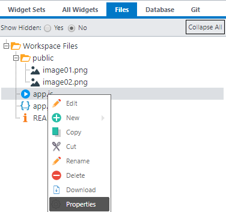
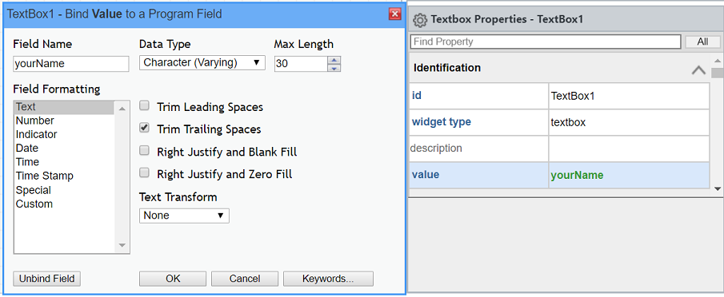

Rich Display Hello World Template
=================================
This template illustrates the basics of Rich Display screens.
The starting Node.js file for this application is **app.js**. To review or change this, right-click 
the file and in the tree and select Properties.

You can run the application from the Launch menu.

Statefulness
------------
This app uses a stateful top-down paradigm, meaning that when a screen is displayed, the Node.js code
is paused to wait for the user's input.

Visual Designer
---------------
The interface was built using the Visual Designer and stored in a Rich Display file named **app.json**.
When you open the json file in the Visual Designer, you can click around to select various widgets 
and view properties assigned to those widgets.

Field Binding
-------------
In the Visual Designer, certain widget properties are directly bound to fields that are exposed to Node.js
code.

For example:
- **yourName** is a character field bound to the *'value'* property of the textbox
- **submit** is a boolean field bound to the *'response'* property of the Submit Answer button
- **exit** is a boolean field bound to the *'response'* property of the Exit button

Layouts
-------
Layouts are widgets that can host other widgets. This example uses a Panel Layout widget.
The layout is centered on the page. This is accomplished by right-clicking
the layout and selecting the Center Horizontally and Center Vertically options.

API
---
- [pjs.defineDisplay()](/docs/profound.js-api/definedisplay) - Create a Rich Display object from json definition
- [display.screen.execute()](/docs/profound.js-api/definedisplay#execute-screen-method) - Display a screen and wait for user to respond
- [display.messageBox()](/docs/profound.js-api/messageBox) - Display a message box
